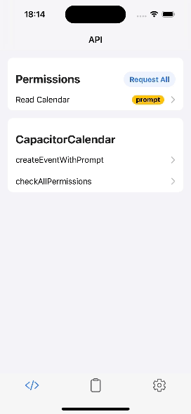
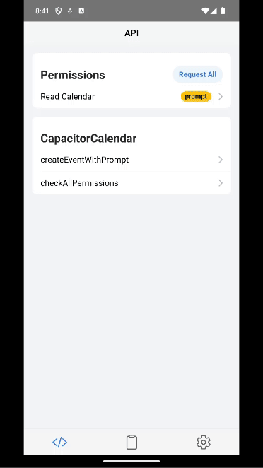

<p align="center">
  
  <br>
    <em>
        The Capacitor Calendar Plugin enables full calendar functionality on iOS and Android, with added reminder support for iOS devices.
    </em>
</p>
<p align="center">
    <a href="https://capacitor-calendar.pages.dev/"><strong>https://capacitor-calendar.pages.dev</strong></a>
    <br>
</p>
<p align="center">
    <a href="SECURITY.md#deployment-targets">Deployment Targets</a>
    <br>
</p>

## Table of Contents

- [Install](#install)
- [Demo](#demo--click-for-details-)
- [Permissions](#permissions)
- [Contributions](#-contributions)
- [API](#api)

## Install

```bash
npm install @ebarooni/capacitor-calendar
npx cap sync
```

## [Demo (click for details)](./example/README.md)

|                 iOS 17                 |                 Android 14                 |
| :------------------------------------: | :----------------------------------------: |
|  |  |

On iOS, `readCalendar` permission is not needed when you a

re creating an event using the native prompt.
The video is just for showing the functionality, otherwise the `createEventWithPrompt` method works without the `readCalendar` authorization.

## Permissions

To be able to use the plugin, you will need to add the required permissions to your app. The required platform-specific
permissions can be found below:

- [iOS](./ios/PERMISSIONS.md)
- [Android](./android/PERMISSIONS.md)

## 💙 Contributions

> [!WARNING]
> Thank you for your interest in contributing to the project! At the moment, the focus is on reaching the first major
> release. Until then, the contributions will not be accepted. This approach allows to set a solid
> foundation and maintain consistency throughout the development process.
>
> Community input is highly valued, and you are encouraged to engage with the project by providing feedback and suggestions.
> Feel free to open issues for bugs you've discovered or enhancements you'd like to see.
>
> Stay tuned for updates. Looking forward to collaborating with you in the future once contributions are opened up!

## API

<docgen-index>

- [`checkPermission(...)`](#checkpermission)
- [`checkAllPermissions()`](#checkallpermissions)
- [`requestPermission(...)`](#requestpermission)
- [`requestAllPermissions()`](#requestallpermissions)
- [`createEventWithPrompt()`](#createeventwithprompt)
- [`selectCalendarsWithPrompt(...)`](#selectcalendarswithprompt)
- [`listCalendars()`](#listcalendars)
- [`getDefaultCalendar()`](#getdefaultcalendar)
- [`createEvent(...)`](#createevent)
- [`getDefaultRemindersList()`](#getdefaultreminderslist)
- [`getRemindersLists()`](#getreminderslists)
- [`createReminder(...)`](#createreminder)
- [`openCalendar(...)`](#opencalendar)
- [`openReminders()`](#openreminders)
- [`listEventsInRange(...)`](#listeventsinrange)
- [`deleteEventsById(...)`](#deleteeventsbyid)
- [Interfaces](#interfaces)
- [Type Aliases](#type-aliases)
- [Enums](#enums)

</docgen-index>

<docgen-api>
<!--Update the source file JSDoc comments and rerun docgen to update the docs below-->

### checkPermission(...)

```typescript
checkPermission(options: { alias: PluginPermission; }) => Promise<{ result: PermissionState; }>
```

Checks the current authorization status of a specific permission.

| Param         | Type                                                                      | Description                               |
| ------------- | ------------------------------------------------------------------------- | ----------------------------------------- |
| **`options`** | <code>{ alias: <a href="#pluginpermission">PluginPermission</a>; }</code> | An object with the name of the permission |

**Returns:** <code>Promise&lt;{ result: <a href="#permissionstate">PermissionState</a>; }&gt;</code>

---

### checkAllPermissions()

```typescript
checkAllPermissions() => Promise<PluginPermissionsMap>
```

Checks the current authorization status of all the required permissions for the plugin.

**Returns:** <code>Promise&lt;<a href="#pluginpermissionsmap">PluginPermissionsMap</a>&gt;</code>

---

### requestPermission(...)

```typescript
requestPermission(options: { alias: PluginPermission; }) => Promise<{ result: PermissionState; }>
```

Requests authorization to a specific permission, if not already granted.
If the permission is already granted, it will directly return the status.

| Param         | Type                                                                      | Description                               |
| ------------- | ------------------------------------------------------------------------- | ----------------------------------------- |
| **`options`** | <code>{ alias: <a href="#pluginpermission">PluginPermission</a>; }</code> | An object with the name of the permission |

**Returns:** <code>Promise&lt;{ result: <a href="#permissionstate">PermissionState</a>; }&gt;</code>

---

### requestAllPermissions()

```typescript
requestAllPermissions() => Promise<PluginPermissionsMap>
```

Requests authorization to all the required permissions for the plugin, if they have not already been granted.

**Returns:** <code>Promise&lt;<a href="#pluginpermissionsmap">PluginPermissionsMap</a>&gt;</code>

---

### createEventWithPrompt()

```typescript
createEventWithPrompt() => Promise<{ result: string[]; }>
```

Creates an event in the calendar by using the native calendar.
On iOS opens a native sheet and on Android opens an intent.

**Returns:** <code>Promise&lt;{ result: string[]; }&gt;</code>

---

### selectCalendarsWithPrompt(...)

```typescript
selectCalendarsWithPrompt(options: { displayStyle: CalendarChooserDisplayStyle; selectionStyle: CalendarChooserSelectionStyle; }) => Promise<{ result: Calendar[]; }>
```

Presents a prompt to the user to select calendars. This method is available only on iOS.

| Param         | Type                                                                                                                                                                                               | Description                                                                         |
| ------------- | -------------------------------------------------------------------------------------------------------------------------------------------------------------------------------------------------- | ----------------------------------------------------------------------------------- |
| **`options`** | <code>{ displayStyle: <a href="#calendarchooserdisplaystyle">CalendarChooserDisplayStyle</a>; selectionStyle: <a href="#calendarchooserselectionstyle">CalendarChooserSelectionStyle</a>; }</code> | - Options for customizing the display and selection styles of the calendar chooser. |

**Returns:** <code>Promise&lt;{ result: Calendar[]; }&gt;</code>

---

### listCalendars()

```typescript
listCalendars() => Promise<{ result: Calendar[]; }>
```

Retrieves a list of calendars available on the device.

**Returns:** <code>Promise&lt;{ result: Calendar[]; }&gt;</code>

---

### getDefaultCalendar()

```typescript
getDefaultCalendar() => Promise<{ result: Calendar; }>
```

Retrieves the default calendar set on the device.

**Returns:** <code>Promise&lt;{ result: <a href="#calendar">Calendar</a>; }&gt;</code>

---

### createEvent(...)

```typescript
createEvent(options: { title: string; calendarId?: string; location?: string; startDate?: number; endDate?: number; isAllDay?: boolean; }) => Promise<{ result: string; }>
```

Creates an event with the provided options.

| Param         | Type                                                                                                                              | Description                       |
| ------------- | --------------------------------------------------------------------------------------------------------------------------------- | --------------------------------- |
| **`options`** | <code>{ title: string; calendarId?: string; location?: string; startDate?: number; endDate?: number; isAllDay?: boolean; }</code> | - Options for creating the event. |

**Returns:** <code>Promise&lt;{ result: string; }&gt;</code>

---

### getDefaultRemindersList()

```typescript
getDefaultRemindersList() => Promise<{ result: RemindersList; }>
```

Retrieves the default reminders list set on the device.

**Returns:** <code>Promise&lt;{ result: <a href="#reminderslist">RemindersList</a>; }&gt;</code>

---

### getRemindersLists()

```typescript
getRemindersLists() => Promise<{ result: RemindersList[]; }>
```

Retrieves all available reminders lists on the device.

**Returns:** <code>Promise&lt;{ result: RemindersList[]; }&gt;</code>

---

### createReminder(...)

```typescript
createReminder(options: { title: string; listId?: string; priority?: number; isCompleted?: boolean; startDate?: number; dueDate?: number; completionDate?: number; notes?: string; url?: string; location?: string; recurrence?: ReminderRecurrenceRule; }) => Promise<{ reminderCreated: boolean; }>
```

Creates a reminder with the provided options.

| Param         | Type                                                                                                                                                                                                                                                                                  | Description                          |
| ------------- | ------------------------------------------------------------------------------------------------------------------------------------------------------------------------------------------------------------------------------------------------------------------------------------- | ------------------------------------ |
| **`options`** | <code>{ title: string; listId?: string; priority?: number; isCompleted?: boolean; startDate?: number; dueDate?: number; completionDate?: number; notes?: string; url?: string; location?: string; recurrence?: <a href="#reminderrecurrencerule">ReminderRecurrenceRule</a>; }</code> | - Options for creating the reminder. |

**Returns:** <code>Promise&lt;{ reminderCreated: boolean; }&gt;</code>

---

### openCalendar(...)

```typescript
openCalendar(options: { date?: number; }) => Promise<void>
```

Opens the calendar app. Since the user leaves your app, use this method with caution.
It will open the calendar on today's date if no date is provided.

| Param         | Type                            | Description                         |
| ------------- | ------------------------------- | ----------------------------------- |
| **`options`** | <code>{ date?: number; }</code> | - Options for opening the calendar. |

---

### openReminders()

```typescript
openReminders() => Promise<void>
```

Opens the reminders app. Since the user leaves your app, use this method with caution.

---

### listEventsInRange(...)

```typescript
listEventsInRange(options: { startDate: number; endDate: number; }) => Promise<{ result: CalendarEvent[]; }>
```

Retrieves the list of calendar events present in the given date range.

| Param         | Type                                                 | Description                          |
| ------------- | ---------------------------------------------------- | ------------------------------------ |
| **`options`** | <code>{ startDate: number; endDate: number; }</code> | Options for defining the date range. |

**Returns:** <code>Promise&lt;{ result: CalendarEvent[]; }&gt;</code>

**Since:** 0.10.0

---

### deleteEventsById(...)

```typescript
deleteEventsById(options: { ids: string[]; }) => Promise<{ result: { deleted: string[]; failed: string[]; }; }>
```

Deletes events from the calendar given their IDs.

| Param         | Type                            | Description                     |
| ------------- | ------------------------------- | ------------------------------- |
| **`options`** | <code>{ ids: string[]; }</code> | Options for defining event IDs. |

**Returns:** <code>Promise&lt;{ result: { deleted: string[]; failed: string[]; }; }&gt;</code>

**Since:** 0.11.0

---

### Interfaces

#### PluginPermissionsMap

#### Calendar

Represents a calendar object.

| Prop        | Type                |
| ----------- | ------------------- |
| **`id`**    | <code>string</code> |
| **`title`** | <code>string</code> |

#### RemindersList

#### ReminderRecurrenceRule

| Prop            | Type                                                                                | Description                                                                                             |
| --------------- | ----------------------------------------------------------------------------------- | ------------------------------------------------------------------------------------------------------- |
| **`frequency`** | <code><a href="#reminderrecurrencefrequency">ReminderRecurrenceFrequency</a></code> | How frequent should the reminder repeat.                                                                |
| **`interval`**  | <code>number</code>                                                                 | The interval should be a number greater than 0. For values lower than 1 the method will throw an error. |
| **`end`**       | <code>number</code>                                                                 | When provided, the reminder will stop repeating at the given time.                                      |

#### CalendarEvent

Represents an event in the calendar.

| Prop                   | Type                 |
| ---------------------- | -------------------- |
| **`id`**               | <code>string</code>  |
| **`title`**            | <code>string</code>  |
| **`location`**         | <code>string</code>  |
| **`eventColor`**       | <code>string</code>  |
| **`organizer`**        | <code>string</code>  |
| **`description`**      | <code>string</code>  |
| **`startDate`**        | <code>number</code>  |
| **`endDate`**          | <code>number</code>  |
| **`eventTimezone`**    | <code>string</code>  |
| **`eventEndTimezone`** | <code>string</code>  |
| **`duration`**         | <code>string</code>  |
| **`isAllDay`**         | <code>boolean</code> |
| **`calendarId`**       | <code>string</code>  |

### Type Aliases

#### PermissionState

<code>'prompt' | 'prompt-with-rationale' | 'granted' | 'denied'</code>

### Enums

#### PluginPermission

| Members               | Value                         | Description                                            |
| --------------------- | ----------------------------- | ------------------------------------------------------ |
| **`READ_CALENDAR`**   | <code>'readCalendar'</code>   | Represents the permission state for reading calendar.  |
| **`WRITE_CALENDAR`**  | <code>'writeCalendar'</code>  | Represents the permission state for writing calendar.  |
| **`READ_REMINDERS`**  | <code>'readReminders'</code>  | Represents the permission state for reading reminders. |
| **`WRITE_REMINDERS`** | <code>'writeReminders'</code> | Represents the permission state for writing reminders. |

#### CalendarChooserDisplayStyle

| Members                       | Description                                              |
| ----------------------------- | -------------------------------------------------------- |
| **`ALL_CALENDARS`**           | Display all calendars available for selection.           |
| **`WRITABLE_CALENDARS_ONLY`** | Display only writable calendars available for selection. |

#### CalendarChooserSelectionStyle

| Members        | Description                                             |
| -------------- | ------------------------------------------------------- |
| **`SINGLE`**   | Allows only a single selection in the calendar chooser. |
| **`MULTIPLE`** | Allows multiple selections in the calendar chooser.     |

#### ReminderRecurrenceFrequency

| Members       | Description                             |
| ------------- | --------------------------------------- |
| **`DAILY`**   | The reminder repeats on a daily basis   |
| **`WEEKLY`**  | The reminder repeats on a weekly basis  |
| **`MONTHLY`** | The reminder repeats on a monthly basis |
| **`YEARLY`**  | The reminder repeats on a yearly basis  |

</docgen-api>
