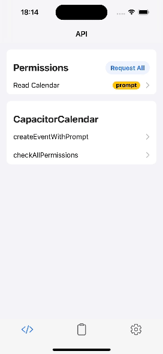
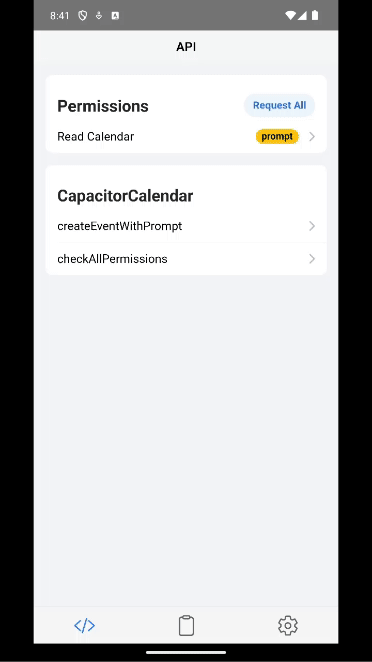

<p align="center">
  
  <br>
  <em>A capacitor plugin for managing calendar events on iOS and Android, with reminders support on iOS.</em>
</p>

<p align="center">
  
  <a href="https://www.npmjs.com/package/@ebarooni/capacitor-calendar">
    
  </a>
  <br>
  <a href="https://www.npmjs.com/package/@ebarooni/capacitor-calendar">
    
  </a>
  <a href="https://www.npmjs.com/package/@ebarooni/capacitor-calendar">
    
  </a>
</p>

## Table of Contents

- [Installation](#installation)
- [Demo](#demo)
- [Setup](#setup)
- [Documentation](#documentation)
- [API](#api)
- [Changelog](#changelog)
- [Contributing](#contributing)
- [License](#license)

## Installation

```bash
npm install @ebarooni/capacitor-calendar
npx cap sync
```

## Demo

|             iOS 18              |             Android 15              |
| :-----------------------------: | :---------------------------------: |
|  |  |

## Setup

This plugin requires additional platform-specific configuration. Follow the official guides:

- **iOS:** [Migrating to the Latest Calendar Access Levels](https://developer.apple.com/documentation/technotes/tn3152-migrating-to-the-latest-calendar-access-levels)
- **Android:** [Calendar Provider User Permissions](https://developer.android.com/identity/providers/calendar-provider#manifest)

## Documentation

For comprehensive usage examples, detailed explanations, and API references, check out:

- **[Online documentation](https://ebarooni.github.io/capacitor-calendar/)**
- **[Type definitions & examples](src/definitions.ts)**

## API

<docgen-index>

- [`checkPermission(...)`](#checkpermission)
- [`checkAllPermissions()`](#checkallpermissions)
- [`requestPermission(...)`](#requestpermission)
- [`requestAllPermissions()`](#requestallpermissions)
- [`requestWriteOnlyCalendarAccess()`](#requestwriteonlycalendaraccess)
- [`requestReadOnlyCalendarAccess()`](#requestreadonlycalendaraccess)
- [`requestFullCalendarAccess()`](#requestfullcalendaraccess)
- [`requestFullRemindersAccess()`](#requestfullremindersaccess)
- [`createEventWithPrompt(...)`](#createeventwithprompt)
- [`modifyEventWithPrompt(...)`](#modifyeventwithprompt)
- [`createEvent(...)`](#createevent)
- [`modifyEvent(...)`](#modifyevent)
- [`commit()`](#commit)
- [`selectCalendarsWithPrompt(...)`](#selectcalendarswithprompt)
- [`fetchAllCalendarSources()`](#fetchallcalendarsources)
- [`listCalendars()`](#listcalendars)
- [`getDefaultCalendar()`](#getdefaultcalendar)
- [`fetchAllRemindersSources()`](#fetchallreminderssources)
- [`openReminders()`](#openreminders)
- [`getDefaultRemindersList()`](#getdefaultreminderslist)
- [`getRemindersLists()`](#getreminderslists)
- [`createReminder(...)`](#createreminder)
- [`openCalendar(...)`](#opencalendar)
- [`listEventsInRange(...)`](#listeventsinrange)
- [`deleteEventsById(...)`](#deleteeventsbyid)
- [`createCalendar(...)`](#createcalendar)
- [`deleteCalendar(...)`](#deletecalendar)
- [`getRemindersFromLists(...)`](#getremindersfromlists)
- [`deleteRemindersById(...)`](#deleteremindersbyid)
- [`modifyReminder(...)`](#modifyreminder)
- [Interfaces](#interfaces)
- [Type Aliases](#type-aliases)
- [Enums](#enums)

</docgen-index>

<docgen-api>
<!--Update the source file JSDoc comments and rerun docgen to update the docs below-->

### checkPermission(...)

```typescript
checkPermission(options: { scope: CalendarPermissionScope; }) => Promise<{ result: PermissionState; }>
```

Retrieves the current permission state for a given scope.

| Param         | Type                                                                                    |
| ------------- | --------------------------------------------------------------------------------------- |
| **`options`** | <code>{ scope: <a href="#calendarpermissionscope">CalendarPermissionScope</a>; }</code> |

**Returns:** <code>Promise&lt;{ result: <a href="#permissionstate">PermissionState</a>; }&gt;</code>

**Since:** 0.1.0

**Platform:** Android, iOS

---

### checkAllPermissions()

```typescript
checkAllPermissions() => Promise<{ result: CheckAllPermissionsResult; }>
```

Retrieves the current state of all permissions.

**Returns:** <code>Promise&lt;{ result: <a href="#checkallpermissionsresult">CheckAllPermissionsResult</a>; }&gt;</code>

**Since:** 0.1.0

**Platform:** Android, iOS

---

### requestPermission(...)

```typescript
requestPermission(options: { scope: CalendarPermissionScope; }) => Promise<{ result: PermissionState; }>
```

Requests permission for a given scope.

| Param         | Type                                                                                    |
| ------------- | --------------------------------------------------------------------------------------- |
| **`options`** | <code>{ scope: <a href="#calendarpermissionscope">CalendarPermissionScope</a>; }</code> |

**Returns:** <code>Promise&lt;{ result: <a href="#permissionstate">PermissionState</a>; }&gt;</code>

**Since:** 0.1.0

**Platform:** Android, iOS

---

### requestAllPermissions()

```typescript
requestAllPermissions() => Promise<{ result: RequestAllPermissionsResult; }>
```

Requests permission for all calendar and reminder permissions.

**Returns:** <code>Promise&lt;{ result: <a href="#checkallpermissionsresult">CheckAllPermissionsResult</a>; }&gt;</code>

**Since:** 0.1.0

**Platform:** Android, iOS

---

### requestWriteOnlyCalendarAccess()

```typescript
requestWriteOnlyCalendarAccess() => Promise<{ result: PermissionState; }>
```

Requests write access to the calendar.

**Returns:** <code>Promise&lt;{ result: <a href="#permissionstate">PermissionState</a>; }&gt;</code>

**Since:** 5.4.0

**Platform:** Android, iOS

---

### requestReadOnlyCalendarAccess()

```typescript
requestReadOnlyCalendarAccess() => Promise<{ result: PermissionState; }>
```

Requests read access to the calendar.

**Returns:** <code>Promise&lt;{ result: <a href="#permissionstate">PermissionState</a>; }&gt;</code>

**Since:** 5.4.0

**Platform:** Android

---

### requestFullCalendarAccess()

```typescript
requestFullCalendarAccess() => Promise<{ result: PermissionState; }>
```

Requests read and write access to the calendar.

**Returns:** <code>Promise&lt;{ result: <a href="#permissionstate">PermissionState</a>; }&gt;</code>

**Since:** 5.4.0

**Platform:** Android, iOS

---

### requestFullRemindersAccess()

```typescript
requestFullRemindersAccess() => Promise<{ result: PermissionState; }>
```

Requests read and write access to the reminders.

**Returns:** <code>Promise&lt;{ result: <a href="#permissionstate">PermissionState</a>; }&gt;</code>

**Since:** 5.4.0

**Platform:** iOS

---

### createEventWithPrompt(...)

```typescript
createEventWithPrompt(options?: CreateEventWithPromptOptions | undefined) => Promise<{ id: string | null; }>
```

Opens the system calendar interface to create a new event.
On Android always return `null`.
Fetch the events to find the ID of the newly created event.

| Param         | Type                                                                                  |
| ------------- | ------------------------------------------------------------------------------------- |
| **`options`** | <code><a href="#createeventwithpromptoptions">CreateEventWithPromptOptions</a></code> |

**Returns:** <code>Promise&lt;{ id: string | null; }&gt;</code>

**Since:** 0.1.0

**Platform:** Android, iOS

---

### modifyEventWithPrompt(...)

```typescript
modifyEventWithPrompt(options: ModifyEventWithPromptOptions) => Promise<{ result: EventEditAction | null; }>
```

Opens a system calendar interface to modify an event.
On Android always returns `null`.

| Param         | Type                                                                                  |
| ------------- | ------------------------------------------------------------------------------------- |
| **`options`** | <code><a href="#modifyeventwithpromptoptions">ModifyEventWithPromptOptions</a></code> |

**Returns:** <code>Promise&lt;{ result: <a href="#eventeditaction">EventEditAction</a> | null; }&gt;</code>

**Since:** 6.6.0

**Platform:** Android, iOS

---

### createEvent(...)

```typescript
createEvent(options: CreateEventOptions) => Promise<{ id: string; }>
```

Creates an event in the calendar.

| Param         | Type                                                              |
| ------------- | ----------------------------------------------------------------- |
| **`options`** | <code><a href="#createeventoptions">CreateEventOptions</a></code> |

**Returns:** <code>Promise&lt;{ id: string; }&gt;</code>

**Since:** 0.4.0

**Platform:** iOS, Android

---

### modifyEvent(...)

```typescript
modifyEvent(options: ModifyEventOptions) => Promise<void>
```

Modifies an event.

| Param         | Type                                                              |
| ------------- | ----------------------------------------------------------------- |
| **`options`** | <code><a href="#modifyeventoptions">ModifyEventOptions</a></code> |

**Since:** 6.6.0

**Platform:** Android, iOS

---

### commit()

```typescript
commit() => Promise<void>
```

Save the changes to the calendar.

**Since:** 7.1.0

**Platform:** iOS

---

### selectCalendarsWithPrompt(...)

```typescript
selectCalendarsWithPrompt(options?: SelectCalendarsWithPromptOptions | undefined) => Promise<{ result: Calendar[]; }>
```

Opens a system interface to choose one or multiple calendars.

| Param         | Type                                                                                          |
| ------------- | --------------------------------------------------------------------------------------------- |
| **`options`** | <code><a href="#selectcalendarswithpromptoptions">SelectCalendarsWithPromptOptions</a></code> |

**Returns:** <code>Promise&lt;{ result: Calendar[]; }&gt;</code>

**Since:** 0.2.0

**Platform:** iOS

---

### fetchAllCalendarSources()

```typescript
fetchAllCalendarSources() => Promise<{ result: CalendarSource[]; }>
```

Retrieves a list of calendar sources.

**Returns:** <code>Promise&lt;{ result: CalendarSource[]; }&gt;</code>

**Since:** 6.6.0

**Platform:** iOS

---

### listCalendars()

```typescript
listCalendars() => Promise<{ result: Calendar[]; }>
```

Retrieves a list of all available calendars.

**Returns:** <code>Promise&lt;{ result: Calendar[]; }&gt;</code>

**Since:** 7.1.0

**Platform:** Android, iOS

---

### getDefaultCalendar()

```typescript
getDefaultCalendar() => Promise<{ result: Calendar | null; }>
```

Retrieves the default calendar.

**Returns:** <code>Promise&lt;{ result: <a href="#calendar">Calendar</a> | null; }&gt;</code>

**Since:** 0.3.0

**Platform:** Android, iOS

---

### fetchAllRemindersSources()

```typescript
fetchAllRemindersSources() => Promise<{ result: CalendarSource[]; }>
```

Retrieves a list of calendar sources.

**Returns:** <code>Promise&lt;{ result: CalendarSource[]; }&gt;</code>

**Since:** 6.6.0

**Platform:** iOS

---

### openReminders()

```typescript
openReminders() => Promise<void>
```

Opens the reminders app.

**Since:** 7.1.0

**Platform:** iOS

---

### getDefaultRemindersList()

```typescript
getDefaultRemindersList() => Promise<{ result: RemindersList | null; }>
```

Retrieves the default reminders list.

**Returns:** <code>Promise&lt;{ result: <a href="#calendar">Calendar</a> | null; }&gt;</code>

**Since:** 7.1.0

**Platform:** iOS

---

### getRemindersLists()

```typescript
getRemindersLists() => Promise<{ result: RemindersList[]; }>
```

Retrieves all available reminders lists.

**Returns:** <code>Promise&lt;{ result: Calendar[]; }&gt;</code>

**Since:** 7.1.0

**Platform:** iOS

---

### createReminder(...)

```typescript
createReminder(options: { title: string; listId?: string; priority?: number; isCompleted?: boolean; startDate?: number; dueDate?: number; completionDate?: number; notes?: string; url?: string; location?: string; recurrence?: ReminderRecurrenceRule; }) => Promise<{ result: string; }>
```

Creates a reminder with the provided options.

| Param         | Type                                                                                                                                                                                                                                                                                  | Description                          |
| ------------- | ------------------------------------------------------------------------------------------------------------------------------------------------------------------------------------------------------------------------------------------------------------------------------------- | ------------------------------------ |
| **`options`** | <code>{ title: string; listId?: string; priority?: number; isCompleted?: boolean; startDate?: number; dueDate?: number; completionDate?: number; notes?: string; url?: string; location?: string; recurrence?: <a href="#reminderrecurrencerule">ReminderRecurrenceRule</a>; }</code> | - Options for creating the reminder. |

**Returns:** <code>Promise&lt;{ result: string; }&gt;</code>

**Since:** 0.5.0

**Platform:** iOS

---

### openCalendar(...)

```typescript
openCalendar(options: { date?: number; }) => Promise<void>
```

Opens the calendar app. Since the user leaves your app, use this method with caution.
It will open the calendar on today's date if no date is provided.

| Param         | Type                            | Description                         |
| ------------- | ------------------------------- | ----------------------------------- |
| **`options`** | <code>{ date?: number; }</code> | - Options for opening the calendar. |

**Platform:** iOS, Android

---

### listEventsInRange(...)

```typescript
listEventsInRange(options: { startDate: number; endDate: number; }) => Promise<{ result: CalendarEvent[]; }>
```

Retrieves the list of calendar events present in the given date range.

| Param         | Type                                                 | Description                          |
| ------------- | ---------------------------------------------------- | ------------------------------------ |
| **`options`** | <code>{ startDate: number; endDate: number; }</code> | Options for defining the date range. |

**Returns:** <code>Promise&lt;{ result: CalendarEvent[]; }&gt;</code>

**Since:** 0.10.0

**Platform:** iOS, Android

---

### deleteEventsById(...)

```typescript
deleteEventsById(options: { ids: string[]; }) => Promise<{ result: { deleted: string[]; failed: string[]; }; }>
```

Deletes events from the calendar given their IDs.

| Param         | Type                            | Description                     |
| ------------- | ------------------------------- | ------------------------------- |
| **`options`** | <code>{ ids: string[]; }</code> | Options for defining event IDs. |

**Returns:** <code>Promise&lt;{ result: { deleted: string[]; failed: string[]; }; }&gt;</code>

**Since:** 0.11.0

**Platform:** iOS, Android

---

### createCalendar(...)

```typescript
createCalendar(options: { title: string; color?: string; sourceId?: string; }) => Promise<{ result: string; }>
```

Creates a calendar

| Param         | Type                                                               | Description                      |
| ------------- | ------------------------------------------------------------------ | -------------------------------- |
| **`options`** | <code>{ title: string; color?: string; sourceId?: string; }</code> | Options for creating a calendar. |

**Returns:** <code>Promise&lt;{ result: string; }&gt;</code>

**Since:** 5.2.0

**Platform:** iOS

---

### deleteCalendar(...)

```typescript
deleteCalendar(options: { id: string; }) => Promise<void>
```

Deletes a calendar by id

| Param         | Type                         | Description                      |
| ------------- | ---------------------------- | -------------------------------- |
| **`options`** | <code>{ id: string; }</code> | Options for deleting a calendar. |

**Since:** 5.2.0

**Platform:** iOS

---

### getRemindersFromLists(...)

```typescript
getRemindersFromLists(options?: { listIds: string[]; } | undefined) => Promise<{ result: Reminder[]; }>
```

Retrieves the list of reminders present in the given date range.

| Param         | Type                                | Description                                                                                                           |
| ------------- | ----------------------------------- | --------------------------------------------------------------------------------------------------------------------- |
| **`options`** | <code>{ listIds: string[]; }</code> | Options for defining the date range. It Will fetch all reminders from all available lists if not provided. (Optional) |

**Returns:** <code>Promise&lt;{ result: Reminder[]; }&gt;</code>

**Since:** 5.3.0

**Platform:** iOS

---

### deleteRemindersById(...)

```typescript
deleteRemindersById(options: { ids: string[]; }) => Promise<{ result: { deleted: string[]; failed: string[]; }; }>
```

Deletes reminders given their IDs.

| Param         | Type                            | Description                        |
| ------------- | ------------------------------- | ---------------------------------- |
| **`options`** | <code>{ ids: string[]; }</code> | Options for defining reminder IDs. |

**Returns:** <code>Promise&lt;{ result: { deleted: string[]; failed: string[]; }; }&gt;</code>

**Since:** 5.3.0

**Platform:** iOS

---

### modifyReminder(...)

```typescript
modifyReminder(options: { id: string; update: { title?: string; listId?: string; priority?: number; isCompleted?: boolean; startDate?: number; dueDate?: number; completionDate?: number; notes?: string; url?: string; location?: string; recurrence?: ReminderRecurrenceRule; }; }) => Promise<void>
```

Modifies a reminder given its id and update details.

| Param         | Type                                                                                                                                                                                                                                                                                                            | Description                          |
| ------------- | --------------------------------------------------------------------------------------------------------------------------------------------------------------------------------------------------------------------------------------------------------------------------------------------------------------- | ------------------------------------ |
| **`options`** | <code>{ id: string; update: { title?: string; listId?: string; priority?: number; isCompleted?: boolean; startDate?: number; dueDate?: number; completionDate?: number; notes?: string; url?: string; location?: string; recurrence?: <a href="#reminderrecurrencerule">ReminderRecurrenceRule</a>; }; }</code> | The options for updating a reminder. |

**Since:** 6.7.0

**Platform:** iOS

---

### Interfaces

#### CreateEventWithPromptOptions

| Prop               | Type                                                            | Description                                                                                        | Since | Platform     |
| ------------------ | --------------------------------------------------------------- | -------------------------------------------------------------------------------------------------- | ----- | ------------ |
| **`title`**        | <code>string</code>                                             |                                                                                                    | 0.1.0 | Android, iOS |
| **`calendarId`**   | <code>string</code>                                             |                                                                                                    | 0.1.0 | iOS          |
| **`location`**     | <code>string</code>                                             |                                                                                                    | 0.1.0 | Android, iOS |
| **`startDate`**    | <code>number</code>                                             |                                                                                                    | 0.1.0 | Android, iOS |
| **`endDate`**      | <code>number</code>                                             |                                                                                                    | 0.1.0 | Android, iOS |
| **`isAllDay`**     | <code>boolean</code>                                            |                                                                                                    | 0.1.0 | Android, iOS |
| **`alerts`**       | <code>number[]</code>                                           | Sets alerts before or after the start of the event in minutes. On iOS only 2 alerts are supported. | 7.1.0 | iOS          |
| **`url`**          | <code>string</code>                                             |                                                                                                    | 0.1.0 | iOS          |
| **`description`**  | <code>string</code>                                             |                                                                                                    | 7.1.0 | Android, iOS |
| **`availability`** | <code><a href="#eventavailability">EventAvailability</a></code> |                                                                                                    | 7.1.0 | Android, iOS |
| **`invitees`**     | <code>string[]</code>                                           | An array of emails to invite.                                                                      | 7.1.0 | Android      |

#### ModifyEventWithPromptOptions

| Prop               | Type                                                            | Description                                                                                        | Since | Platform     |
| ------------------ | --------------------------------------------------------------- | -------------------------------------------------------------------------------------------------- | ----- | ------------ |
| **`title`**        | <code>string</code>                                             |                                                                                                    | 0.1.0 | Android, iOS |
| **`calendarId`**   | <code>string</code>                                             |                                                                                                    | 0.1.0 | iOS          |
| **`location`**     | <code>string</code>                                             |                                                                                                    | 0.1.0 | Android, iOS |
| **`startDate`**    | <code>number</code>                                             |                                                                                                    | 0.1.0 | Android, iOS |
| **`endDate`**      | <code>number</code>                                             |                                                                                                    | 0.1.0 | Android, iOS |
| **`isAllDay`**     | <code>boolean</code>                                            |                                                                                                    | 0.1.0 | Android, iOS |
| **`alerts`**       | <code>number[]</code>                                           | Sets alerts before or after the start of the event in minutes. On iOS only 2 alerts are supported. | 7.1.0 | iOS          |
| **`url`**          | <code>string</code>                                             |                                                                                                    | 0.1.0 | iOS          |
| **`description`**  | <code>string</code>                                             |                                                                                                    | 7.1.0 | Android, iOS |
| **`availability`** | <code><a href="#eventavailability">EventAvailability</a></code> |                                                                                                    | 7.1.0 | Android, iOS |
| **`invitees`**     | <code>string[]</code>                                           | An array of emails to invite.                                                                      | 7.1.0 | Android      |
| **`id`**           | <code>string</code>                                             | The ID of the event to be modified.                                                                | 7.1.0 | Android, iOS |

#### CreateEventOptions

| Prop               | Type                                                            | Description                                                                | Default           | Since | Platform     |
| ------------------ | --------------------------------------------------------------- | -------------------------------------------------------------------------- | ----------------- | ----- | ------------ |
| **`title`**        | <code>string</code>                                             |                                                                            |                   | 0.4.0 | Android, iOS |
| **`calendarId`**   | <code>string</code>                                             |                                                                            |                   | 0.1.0 | Android, iOS |
| **`location`**     | <code>string</code>                                             |                                                                            |                   | 0.1.0 | Android, iOS |
| **`startDate`**    | <code>number</code>                                             |                                                                            |                   | 0.1.0 | Android, iOS |
| **`endDate`**      | <code>number</code>                                             |                                                                            |                   | 0.1.0 | Android, iOS |
| **`isAllDay`**     | <code>boolean</code>                                            |                                                                            |                   | 0.1.0 | Android, iOS |
| **`alerts`**       | <code>number[]</code>                                           |                                                                            |                   | 7.1.0 | Android, iOS |
| **`url`**          | <code>string</code>                                             |                                                                            |                   | 0.1.0 | iOS          |
| **`description`**  | <code>string</code>                                             |                                                                            |                   | 7.1.0 | Android, iOS |
| **`availability`** | <code><a href="#eventavailability">EventAvailability</a></code> |                                                                            |                   | 7.1.0 | Android, iOS |
| **`organizer`**    | <code>string</code>                                             | Email of the event organizer.                                              |                   | 7.1.0 | Android      |
| **`color`**        | <code>string</code>                                             |                                                                            |                   | 7.1.0 | Android      |
| **`duration`**     | <code>string</code>                                             | Duration of the event in RFC2445 format.                                   |                   | 7.1.0 | Android      |
| **`commit`**       | <code>boolean</code>                                            | Whether to save immediately (`true`) or batch changes for later (`false`). | <code>true</code> | 7.1.0 | iOS          |
| **`attendees`**    | <code>EventGuest[]</code>                                       | The event guests.                                                          |                   | 7.1.0 | Android      |

#### EventGuest

| Prop        | Type                | Since |
| ----------- | ------------------- | ----- |
| **`name`**  | <code>string</code> | 7.1.0 |
| **`email`** | <code>string</code> | 7.1.0 |

#### ModifyEventOptions

| Prop               | Type                                                            | Description                              | Default                           | Since | Platform     |
| ------------------ | --------------------------------------------------------------- | ---------------------------------------- | --------------------------------- | ----- | ------------ |
| **`id`**           | <code>string</code>                                             | The ID of the event to be modified.      |                                   | 7.1.0 | Android, iOS |
| **`title`**        | <code>string</code>                                             |                                          |                                   | 0.4.0 | Android, iOS |
| **`calendarId`**   | <code>string</code>                                             |                                          |                                   | 0.1.0 | Android, iOS |
| **`location`**     | <code>string</code>                                             |                                          |                                   | 0.1.0 | Android, iOS |
| **`startDate`**    | <code>number</code>                                             |                                          |                                   | 0.1.0 | Android, iOS |
| **`endDate`**      | <code>number</code>                                             |                                          |                                   | 0.1.0 | Android, iOS |
| **`isAllDay`**     | <code>boolean</code>                                            |                                          |                                   | 0.1.0 | Android, iOS |
| **`alerts`**       | <code>number[]</code>                                           |                                          |                                   | 7.1.0 | Android, iOS |
| **`url`**          | <code>string</code>                                             |                                          |                                   | 0.1.0 | iOS          |
| **`description`**  | <code>string</code>                                             |                                          |                                   | 7.1.0 | Android, iOS |
| **`availability`** | <code><a href="#eventavailability">EventAvailability</a></code> |                                          |                                   | 7.1.0 | Android, iOS |
| **`organizer`**    | <code>string</code>                                             | Email of the event organizer.            |                                   | 7.1.0 | Android      |
| **`color`**        | <code>string</code>                                             |                                          |                                   | 7.1.0 | Android      |
| **`duration`**     | <code>string</code>                                             | Duration of the event in RFC2445 format. |                                   | 7.1.0 | Android      |
| **`attendees`**    | <code>EventGuest[]</code>                                       | The event guests.                        |                                   | 7.1.0 | Android      |
| **`span`**         | <code><a href="#eventspan">EventSpan</a></code>                 | The span of modifications.               | <code>EventSpan.THIS_EVENT</code> |       | iOS          |

#### Calendar

| Prop                             | Type                                                              | Description                                                        | Since | Platform     |
| -------------------------------- | ----------------------------------------------------------------- | ------------------------------------------------------------------ | ----- | ------------ |
| **`id`**                         | <code>string</code>                                               |                                                                    | 7.1.0 | Android, iOS |
| **`title`**                      | <code>string</code>                                               |                                                                    | 7.1.0 | Android, iOS |
| **`internalTitle`**              | <code>string \| null</code>                                       | Internal name of the calendar (`CalendarContract.Calendars.NAME`). | 7.1.0 | Android      |
| **`color`**                      | <code>string</code>                                               |                                                                    | 7.1.0 | Android, iOS |
| **`isImmutable`**                | <code>boolean \| null</code>                                      |                                                                    | 7.1.0 | iOS          |
| **`allowsContentModifications`** | <code>boolean \| null</code>                                      |                                                                    | 7.1.0 | iOS          |
| **`type`**                       | <code><a href="#calendartype">CalendarType</a> \| null</code>     |                                                                    | 7.1.0 | iOS          |
| **`isSubscribed`**               | <code>boolean \| null</code>                                      |                                                                    | 7.1.0 | iOS          |
| **`source`**                     | <code><a href="#calendarsource">CalendarSource</a> \| null</code> |                                                                    | 7.1.0 | iOS          |
| **`visible`**                    | <code>boolean \| null</code>                                      | Indicates if the events from this calendar should be shown.        | 7.1.0 | Android      |
| **`accountName`**                | <code>string \| null</code>                                       | The account under which the calendar is registered.                | 7.1.0 | Android      |
| **`ownerAccount`**               | <code>string \| null</code>                                       | The owner of the calendar.                                         | 7.1.0 | Android      |
| **`maxReminders`**               | <code>number \| null</code>                                       | Maximum number of reminders allowed per event.                     | 7.1.0 | Android      |
| **`location`**                   | <code>string \| null</code>                                       |                                                                    | 7.1.0 | Android      |

#### CalendarSource

| Prop        | Type                                                              | Since |
| ----------- | ----------------------------------------------------------------- | ----- |
| **`type`**  | <code><a href="#calendarsourcetype">CalendarSourceType</a></code> | 7.1.0 |
| **`id`**    | <code>string</code>                                               | 7.1.0 |
| **`title`** | <code>string</code>                                               | 7.1.0 |

#### SelectCalendarsWithPromptOptions

| Prop               | Type                                                                                | Description                | Default                                                | Since |
| ------------------ | ----------------------------------------------------------------------------------- | -------------------------- | ------------------------------------------------------ | ----- |
| **`displayStyle`** | <code><a href="#calendarchooserdisplaystyle">CalendarChooserDisplayStyle</a></code> |                            | <code>CalendarChooserDisplayStyle.ALL_CALENDARS</code> | 7.1.0 |
| **`multiple`**     | <code>boolean</code>                                                                | Allow multiple selections. | <code>false</code>                                     | 7.1.0 |

#### ReminderRecurrenceRule

| Prop            | Type                                                                                | Description                                                                                             |
| --------------- | ----------------------------------------------------------------------------------- | ------------------------------------------------------------------------------------------------------- |
| **`frequency`** | <code><a href="#reminderrecurrencefrequency">ReminderRecurrenceFrequency</a></code> | How frequent should the reminder repeat.                                                                |
| **`interval`**  | <code>number</code>                                                                 | The interval should be a number greater than 0. For values lower than 1 the method will throw an error. |
| **`end`**       | <code>number</code>                                                                 | When provided, the reminder will stop repeating at the given time.                                      |

#### CalendarEvent

Represents an event in the calendar.

| Prop                   | Type                                                   | Platform     |
| ---------------------- | ------------------------------------------------------ | ------------ |
| **`id`**               | <code>string</code>                                    | iOS, Android |
| **`title`**            | <code>string</code>                                    | iOS, Android |
| **`location`**         | <code>string</code>                                    | iOS, Android |
| **`eventColor`**       | <code>string</code>                                    | iOS, Android |
| **`organizer`**        | <code>string</code>                                    | iOS, Android |
| **`description`**      | <code>string</code>                                    | iOS, Android |
| **`startDate`**        | <code>number</code>                                    | iOS, Android |
| **`endDate`**          | <code>number</code>                                    | iOS, Android |
| **`eventTimezone`**    | <code>{ region: string; abbreviation: string; }</code> | iOS, Android |
| **`eventEndTimezone`** | <code>{ region: string; abbreviation: string; }</code> | iOS, Android |
| **`duration`**         | <code>string</code>                                    | Android      |
| **`isAllDay`**         | <code>boolean</code>                                   | iOS, Android |
| **`calendarId`**       | <code>string</code>                                    | iOS, Android |
| **`url`**              | <code>string</code>                                    | iOS          |

#### Reminder

Represents a reminder in a reminders list.

| Prop                 | Type                                  | Platform |
| -------------------- | ------------------------------------- | -------- |
| **`id`**             | <code>string</code>                   | iOS      |
| **`title`**          | <code>string</code>                   | iOS      |
| **`listId`**         | <code>string</code>                   | iOS      |
| **`isCompleted`**    | <code>boolean</code>                  | iOS      |
| **`priority`**       | <code>number</code>                   | iOS      |
| **`notes`**          | <code>string</code>                   | iOS      |
| **`location`**       | <code>string</code>                   | iOS      |
| **`url`**            | <code>string</code>                   | iOS      |
| **`startDate`**      | <code>number</code>                   | iOS      |
| **`dueDate`**        | <code>number</code>                   | iOS      |
| **`completionDate`** | <code>number</code>                   | iOS      |
| **`recurrence`**     | <code>ReminderRecurrenceRule[]</code> | iOS      |

### Type Aliases

#### PermissionState

<code>'prompt' | 'prompt-with-rationale' | 'granted' | 'denied'</code>

#### CheckAllPermissionsResult

<code><a href="#record">Record</a>&lt; <a href="#calendarpermissionscope">CalendarPermissionScope</a>, <a href="#permissionstate">PermissionState</a> &gt;</code>

#### Record

Construct a type with a set of properties K of type T

<code>{
[P in K]: T;
}</code>

#### RequestAllPermissionsResult

<code><a href="#checkallpermissionsresult">CheckAllPermissionsResult</a></code>

#### EventEditAction

<code>"canceled" | "saved" | "deleted"</code>

#### RemindersList

<code><a href="#calendar">Calendar</a></code>

### Enums

#### CalendarPermissionScope

| Members               | Value                         | Description                                                  | Since | Platform     |
| --------------------- | ----------------------------- | ------------------------------------------------------------ | ----- | ------------ |
| **`READ_CALENDAR`**   | <code>"readCalendar"</code>   | Permission required for reading calendar events.             | 7.1.0 | Android, iOS |
| **`READ_REMINDERS`**  | <code>"readReminders"</code>  | Permission required for reading reminders.                   | 7.1.0 | iOS          |
| **`WRITE_CALENDAR`**  | <code>"writeCalendar"</code>  | Permission required for adding or modifying calendar events. | 7.1.0 | Android, iOS |
| **`WRITE_REMINDERS`** | <code>"writeReminders"</code> | Permission required for adding or modifying reminders.       | 7.1.0 | iOS          |

#### EventAvailability

| Members             | Value           | Since | Platform     |
| ------------------- | --------------- | ----- | ------------ |
| **`NOT_SUPPORTED`** | <code>-1</code> | 7.1.0 | iOS          |
| **`BUSY`**          |                 | 7.1.0 | Android, iOS |
| **`FREE`**          |                 | 7.1.0 | Android, iOS |
| **`TENTATIVE`**     |                 | 7.1.0 | Android, iOS |
| **`UNAVAILABLE`**   |                 | 7.1.0 | iOS          |

#### EventSpan

| Members                      | Since |
| ---------------------------- | ----- |
| **`THIS_EVENT`**             | 7.1.0 |
| **`THIS_AND_FUTURE_EVENTS`** | 7.1.0 |

#### CalendarType

| Members            | Since |
| ------------------ | ----- |
| **`LOCAL`**        | 7.1.0 |
| **`CAL_DAV`**      | 7.1.0 |
| **`EXCHANGE`**     | 7.1.0 |
| **`SUBSCRIPTION`** | 7.1.0 |
| **`BIRTHDAY`**     | 7.1.0 |

#### CalendarSourceType

| Members          | Since |
| ---------------- | ----- |
| **`LOCAL`**      | 7.1.0 |
| **`EXCHANGE`**   | 7.1.0 |
| **`CAL_DAV`**    | 7.1.0 |
| **`MOBILE_ME`**  | 7.1.0 |
| **`SUBSCRIBED`** | 7.1.0 |
| **`BIRTHDAYS`**  | 7.1.0 |

#### CalendarChooserDisplayStyle

| Members                       | Since |
| ----------------------------- | ----- |
| **`ALL_CALENDARS`**           | 0.2.0 |
| **`WRITABLE_CALENDARS_ONLY`** | 0.2.0 |

#### ReminderRecurrenceFrequency

| Members       | Description                             |
| ------------- | --------------------------------------- |
| **`DAILY`**   | The reminder repeats on a daily basis   |
| **`WEEKLY`**  | The reminder repeats on a weekly basis  |
| **`MONTHLY`** | The reminder repeats on a monthly basis |
| **`YEARLY`**  | The reminder repeats on a yearly basis  |

</docgen-api>

## Changelog

See [CHANGELOG.md](CHANGELOG.md) for the latest updates and release history.

## Contributing

See [CONTRIBUTING.md](CONTRIBUTING.md) for guidelines.

## License

This project is licensed under the **MIT License**. See [LICENSE](LICENSE) for details.
